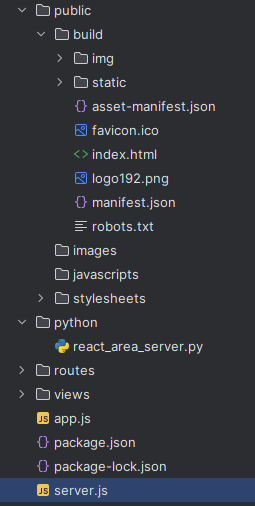
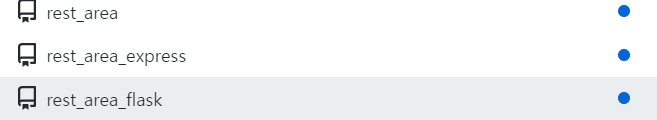
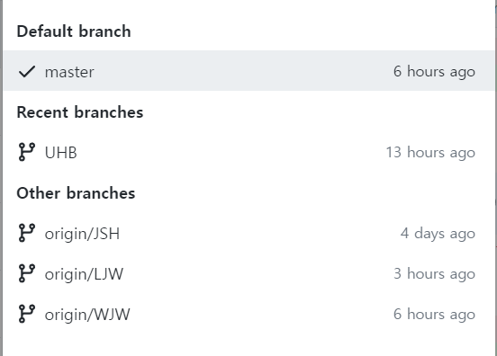
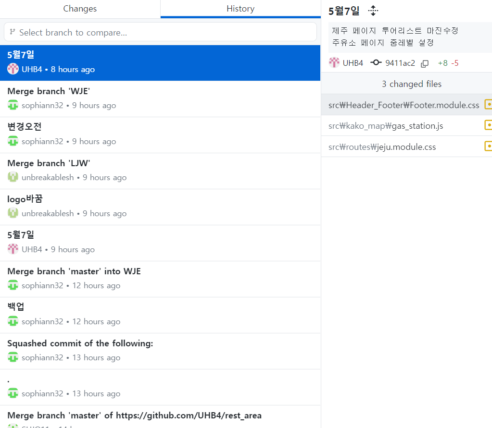
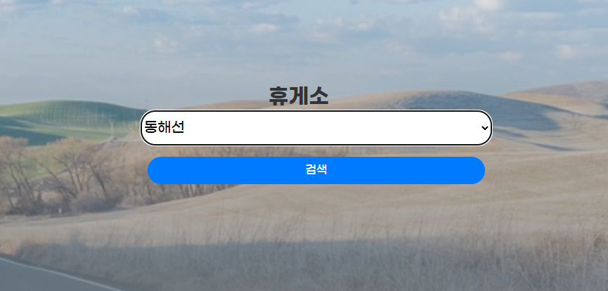
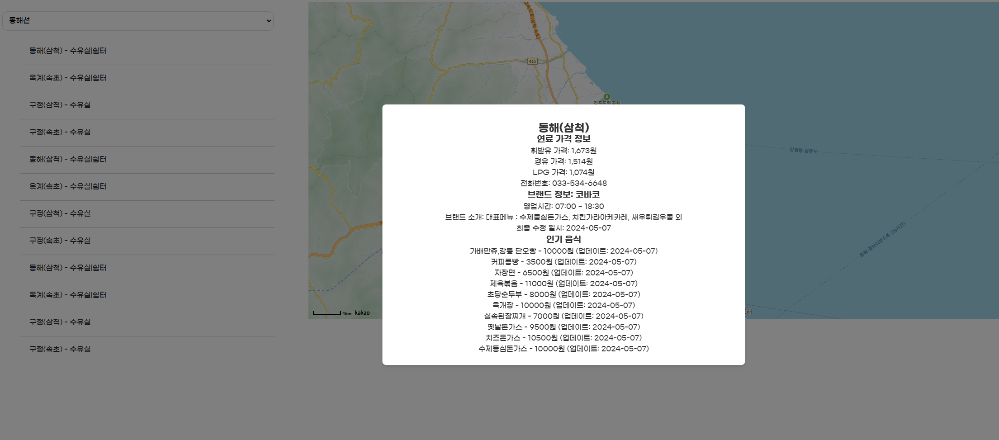
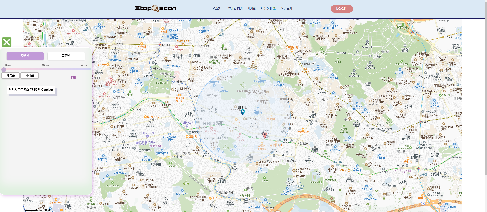
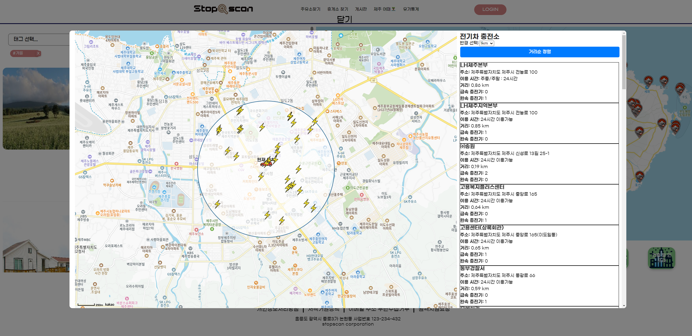
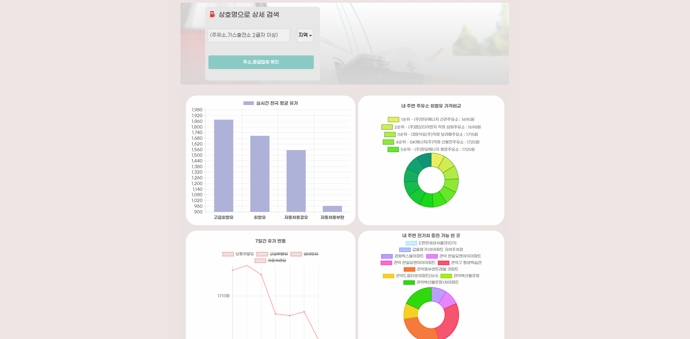
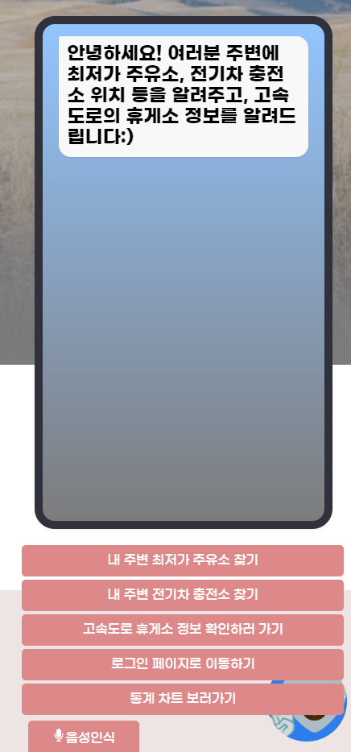

# Stop scan

## 프로젝트 소개 
고속도로를 이용하는 운전자들을 위해 다양한 고속도로 휴게소, 주유소, 전기차 충전소 정보를 제공하는 웹 애플리케이션<br>
실시간 정보, 주변 편의시설, 관광 명소 등을 한눈에 확인할 수 있다.

## 프로젝트 팀 
- **엄현빈** - 프로젝트 관리,데이터수집,백엔드 개발,UI디자인 
- **이재우** - 프론트엔드 개발,게시판기능,백엔드 개발
- **위지은** - 통계페이지 개발,프론트엔드 개발 
- **조수호** - 챗봇개발,프론트엔드 개발


## 기능
- 고속도로별 휴게소 정보 조회 
- 휴게소 상세 정보 및 편의시설 확인
- 지도 기반 휴게소 위치확인
- 주변 주유소 및 충전소 실시간 상태확인 
- 제주도 관광명소,제주도 충전소 실시간 상태확인
- 음성인식 기능을 통한 정보제공 챗봇
- 실시간 유가차트 확인 
- 상호로 주유소 주소,공급업체 검색

## 사용기술

- **프론트엔드**: React, CSS Modules, Kakao Maps SDK
- **백엔드**: Node.js, Express
- **데이터분석**: python
- **데이터수집**: Flask
- **데이터베이스**: oracleDB
- **배포**: AWS EC2
  
## 구조
   


## 프로젝트 관리 

   
각 서버를 효율적으로 관리하기 위해, React, Express, 그리고 Flask를 사용하는 세 개의 서버에 각각 원격 레포지토리를 생성

   
   
각자가 자신의 브랜치를 만들어 작업하고, 마스터 브랜치에 업데이트하는 방식으로 작업을 진행




## 주요기능 스크린샷 


   
```
메인화면에서 고속도로를 선택하고 검색을 누름.
```
  
```
선택한 해당 노선에 있는 휴게소 리스트가 나오고 맵에 마커로 표시
```
   
```
실시간 내위치를 기반으로 반경내 주유소 , 충전소 의 가격과 실시간 상태를 제공
```
   
```
카테고리별 선택, 태그별 선택으로 관광지 정보제공
```

```
제주도 전기차 충전소 상태 제공
```
   
* 검색
```
- 전국 주유소,충전소 상호명으로 주소,공급업체 확인 가능
````
* 차트 (실시간 데이터)
```
- 전국 주유소 평균가격        > 전반적인 상품별 가격 확인  
- 내 주변 주유소,충전소 가격   > 가격순 (색상,크기로 확인) 
- 최근 7일간 전국 일일 평균가격 > 상품별 가격 추세 가능
- 내 주변 전기차 충전소명 (슬롯수 제공업체가 많다는 가정) 
``` 
 

실시간 사용자의 위치를 기반으로 반경내 최저가 주유소 , 전기차 충전소의 위치 정보 제공<br>
STT와 TTS기능을 추가하여 챗봇 고도화
   


