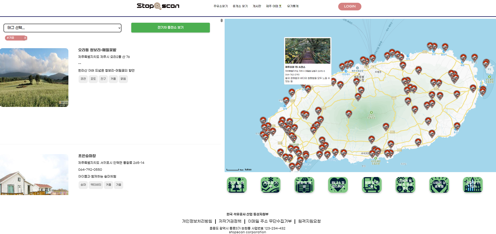

# Stop scan

## 프로젝트 소개 
고속도로를 이용하는 운전자들을 위해 다양한 고속도로 휴게소, 주유소, 전기차 충전소 정보를 제공하는 웹 애플리케이션 
실시간 정보, 주변 편의시설, 관광 명소 등을 한눈에 확인할 수 있다.

## 프로젝트 팀 
- **엄현빈** - 프로젝트 관리,데이터수집,백엔드 개발,UI디자인 
- **이재우** - 프론트엔드 개발,게시판기능,백엔드 개발
- **위지은** - 통계페이지 개발,프론트엔드 개발 
- **조수호** - 챗봇개발,프론트엔드 개발

## 기능
- 고속도로별 휴게소 정보 조회 
- 휴게소 상세 정보 및 편의시설 확인
- 지도 기반 휴게소 위치확인
- 주변 주유소 및 충전소 실시간 상태확인 
- 제주도 관광명소,제주도 충전소 실시간 상태확인
- 음성인식 기능을 통한 정보제공 챗봇
- 실시간 유가차트 확인 
- 상호로 주유소 주소,공급업체 검색

## 사용기술

- **프론트엔드**: React, CSS Modules, Kakao Maps SDK
- **백엔드**: Node.js, Express
- **데이터분석**: python
- **데이터수집**: Flask
- **데이터베이스**: oracleDB
- **배포**: AWS EC2
  
## 배포구조
   
* #### `aws`에 배포시 구조입니다
## 리엑트구조
   
* #### `react` APP.JS 의 라우터 형태입니다.

* AXIOS 글로벌 설정과 이용한 모듈입니다.
## EXPRESS구조

* #### `express` 에서는 대부분 오라클DB에서 데이터를 불러오는 서버입니다.

* #### `session` 설정한 부분입니다. 로그인이후 세션이 유지 가능하게 해줍니다.

## 프로젝트 관리 

   
각 서버를 효율적으로 관리하기 위해, React, Express, 그리고 Flask를 사용하는 세 개의 서버에 각각 원격 레포지토리를 생성

   
   
각자가 자신의 브랜치를 만들어 작업하고, 마스터 브랜치에 업데이트하는 방식으로 작업을 진행

## 주요기능 스크린샷 

   

사용자가 원하는 도로를 선택할 수 있는 드롭다운 메뉴 제공.
사용자가 도로를 선택하고 "검색" 버튼을 클릭하면, 선택된 도로에 해당하는 휴게소 페이지(/restarea/${selectedRoute})로 네비게이션

  

넘어온 URL 에서 도로 이름 추출하고 해당 도로에 있는 휴게소 정보를 서버에서 가져옴
axios를 사용하여 휴게소정보외에도 브랜드,연료가격,시설,인기음식 등에 대한 추가데이터를 비동기적으로 가져옴.

   

실시간 내위치를 기반으로 반경내 주유소 , 충전소 의 가격과 실시간 상태를 제공

사용자의 현재 위치를 받고 그위치로 서버에다 요청을하고
주변의 주유소및 충전소 데이터를 받아옴.

파이썬으로 api를 요청해 적재한 30만개의 충전소 정보 데이터와
실시간으로 서버에서 요청한 충전소 상태 api의 statid를 매칭해 일치하는 데이터만 맵과 리스트의
표시
   

카테고리별 선택, 태그별 선택으로 관광지 정보제공

제주도 전기차 충전소 상태 제공

   
#### * 검색
전국 주유소,충전소의 상호명으로 주소와 공급업체 확인 가능  
#### * 실시간 차트   
  | 전국 주유소 평균가격     | 내 주변 주유소,충전소 가격 |
  |---|---|
  |전반적인 상품별 가격 확인    | 가격순 (색상,크기로 확인) |

  
  |최근 7일간 전국 일일 평균가격 | 내 주변 전기차 충전소명 |
  |---|---|
  |상품별 가격 추세 확인   |(슬롯수 제공업체가 많다는 가정)|

 

#### 챗봇
- Geolocation 함수를 이용하여 실시간 사용자의 위치를 기반으로 반경내 최저가 주유소 , 전기차 충전소의 위치 정보 제공
- xml 형식으로 된 주유소 데이터와, SQL 오라클DB에 넣어놓은 전기차 충전소 데이터를 불러오는 방식이 각각 달랐지만 Flask서버를 이용하여 문제 없이 불러옴.  
- STT와 TTS기능을 추가하여 챗봇 고도화  > 음성인식 기능을 추가하여 사용자가 음성으로   키워드를 입력하면 그에 맞는 데이터를 불러와 채팅 메시지로 그에 맞는 정보가 표시되게 구  현하였고(TTS), 모든 메시지를 읽어주는 기능을 구현했다(STT).
- 우리 사이트의 주요 페이지와 로그인 페이지를 간편하게 바로 들어가질 수 있게 버튼을 누	  르면 채팅 메시지로 링크가 띄워지도록 구현함.
- 이전 프로젝트보다 좀 더 고도화된 기능들을 적용시키는 거에 중점을 뒀다.

   

